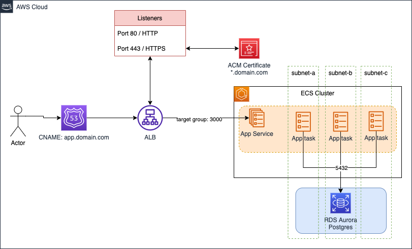

# Submission to Servian Tech Challenge

- [LinkedIn](https://www.linkedin.com/in/vanessadenardin/)
- [Application live version](https://servian-tech-challenge.vanessadenardin.com/)

---

TABLE OF CONTENTS:

1. [Tech Challenge Overview](#1-tech-challenge-overview)

2. [High level design diagram](#2-high-level-design-diagram)

3. [About technology choices](#3-about-technology-choices)

    - [AWS](#aws)
    - [Amazon Elastic Container Service (ECS)](#amazon-elastic-container-service-ecs)
    - [Amazon Elastic Load Balancing (ALB)](#amazon-elastic-load-balancing-alb)
    - [Amazon Relational Database Service (RDS)](#amazon-relational-database-service-rds)
    - [Amazon Certificate Manager (ACM)](#amazon-certificate-manager-acm)
    - [Amazon Route 53](#amazon-route-53)
    - [Amazon Simple Storage Service (S3)](#amazon-simple-storage-service-s3)
    - [AWS Identity and Access Management (IAM)](#aws-identity-and-access-management-iam)
    - [Amazon Security Groups](#amazon-security-groups)
    - [Amazon CloudWatch](#amazon-cloudwatch)
    - [GitHub and GitHub Actions](#github-and-github-actions)
    - [3Musketeers](#3musketeers)
    - [Terraform](#terraform)

4. [How to deploy](#4-how-to-deploy)

    - [Dependencies](#dependencies)
    - [AWS account authentication](#aws-account-authentication)
    - [Manually create an S3 bucket in your AWS account](#manually-create-an-s3-bucket-in-your-aws-account)
    - [Configure Terraform backend and variables](#configure-terraform-backend-and-variables)
    - [Run Terraform](#run-terraform)
    - [Run update on database](#run-update-on-database)
    - [Delete the stack](#delete-the-stack)

5. [GitHub Actions](#5-github-actions)

6. [Challenges](#6-challenges)

7. [Future recommendations](#7-future-recommendations)

---

## 1. Tech Challenge Overview

This project was made as a requirement during the Servian's Graduate Program application. As part of my learning process I chose to use containers, as I had already experienced virtual machines and configuration management with Ansible in another project. In addition, containers implementations are more cloud native and the opportunity would help me on my pathway to learn DevOps.

---

## 2. High level design diagram



*The above diagram represents a high available solution (tasks and database deployed in multiple subnets). For demonstration and learning purposes, the implementation is fixed to deploy a single replica for the database and only 2 ECS tasks.*

---

## 3. About technology choices

### AWS

AWS was chosen as the cloud provider for this project as it's one of the largest cloud provider on the market, it's easier to find information, and I have used before to other projects. Even though I have a Azure certification, I still have more confidence with AWS products and services.

### Amazon Elastic Container Service (ECS)

ECS was used for manage containers on a cluster running tasks in a service. Fargate was used to remove the need of EC2 intances as it's a serverless compute engine.

### Amazon Elastic Load Balancing (ALB)

ALB was used to cover application high availability and auto-scaling. The incomming traffic is distributed in the target group to route requests from the listeners in port 80 HTTP and in port 443 HTTPS with the TLS protocol using certificate.

### Amazon Relational Database Service (RDS)

Aurora PostgreSQL was used to migrate the database.

### Amazon Certificate Manager (ACM)

To increase security, an SSL/TLS certificate was acquired to be able to encrypt network communications on the application website.

### Amazon Route 53

To route end users to the application website creating a CNAME for the public ALB DNS. This is an optional resource.

### Amazon Simple Storage Service (S3)

Just a single bucket to store the Terraform state file.

### AWS Identity and Access Management (IAM)

To access control across services and resources of AWS. An User was created to give local and GitHub Action access to the AWS account and also a Role to give the ECS Task access to write logs to CloudWatch.

### Amazon Security Groups

To control inbound and outbound traffic, 3 security groups are added, on the server with inbound 3000 from the load balancer and outbound to everywhere, on the database with inbound 5432 from server, with no outbound, and on the load balancer with inbound from 80 and 443 for all and outbound 3000 for all for healthchecks.

### Amazon CloudWatch

Because it is integrated with ECS, it was used to monitor and collect data in the form of logs to troubleshoot and keep the application running.

### GitHub and GitHub Actions

Source code management and to automate the application workflow. It was configured in this case to run everytime a GitHub event like pull request (plan) and push/merge (apply).

[GitHub Actions Plan](https://github.com/vanessadenardin/servian-tech-challenge/runs/4710428483?check_suite_focus=true)

[GitHub Actions Apply](https://github.com/vanessadenardin/servian-tech-challenge/runs/4710317126?check_suite_focus=true)

### 3Musketeers

It makes reference to the use of the 3 technologies, Docker, Make and Docker Compose, used to test, build, run and deploy the application. 3Musketeers mainly helps with consistency across environments, running the same commands no matter if you are running the deployment locally or from a pipeline.

### Terraform

Infrastructure as a code tool is used to manage cloud services and due to its declarative syntax, it is easier to track changes through source code. In this case, it was used to create, manage and destroy AWS resources.

---

## 4. How to deploy

### Dependencies

- [Docker](https://www.docker.com/)
- [Docker-Compose](https://docs.docker.com/compose/)
- Make
- [Terraform 1.1.2](https://www.terraform.io/)
- [AWS CLI](https://aws.amazon.com/cli/)

### AWS account authentication

To run below commands, you will need to make sure to be authenticated to an AWS account. That can be done either exporting an AWS IAM User key/secret or by using roles if you have that setup.

[Configure AWS cli credentials](https://docs.aws.amazon.com/cli/latest/userguide/cli-configure-files.html#cli-configure-files-where)

### Manually create an S3 bucket in your AWS account

No extra configuration is needed, just make sure your AWS credentials have access to the S3 bucket.

[Create a S3 Bucket](https://docs.aws.amazon.com/AmazonS3/latest/userguide/creating-bucket.html)

### Configure Terraform backend and variables

Before running the Terraform commands, you will need to make sure to configure your backend to point to your own S3 Bucket and have all following parameters configured as environment variables.

To configure the backend, you will need to edit the file [config.tf](/infra/config.tf) with below:

```terraform
    backend "s3" {
    bucket = "<your-bucket-name"
    key    = "terraform.tfstate"
    region = "ap-southeast-2"
    }
```

```bash
# AWS VPC ID to deploy the stack
export TF_VAR_vpc_id=<value>
# Database password, default username is 'postgres'
export TF_VAR_postgresql_password=<value>
# OPTIONAL: an existing domain name on your AWS account to create a CNAME record for the Load Balancer. If not specified, you will need to access through the LB public dns name
export TF_VAR_domain_name=<value>
# OPTIONAL: an ACM certificate ARN to be used by the 443 listener on the Load Balancer. If not specified, only port 80 will work
export TF_VAR_certificate_arn=<value>
# true/false (default false) -- If true, will prevent to deploy ECS Tasks with Public IPS. This in theory would only work with some re-work to add support to private subnets. I only used this for now to demonstrate some conditional values on Terraform.
export TF_VAR_production=<value>
```

### Run Terraform

With all variables configured, you can run the following Terraform commands:

- `make init`
    This will configure the backend in the config.tf file and download the cloud provider being used, in this case AWS.
- `make plan`
    This will show you which AWS resources will be deployed and save the result in a file called `terraform.plan`.
- `make apply`
    This will apply the `terraform.plan` file (it won't ask for approval!!) created in the previous step to deploy resources to your AWS account and create the `terraform.tfstate` file in your previously manually created S3 bucket.

    After the creation, it will return some outputs with the information of the resources created in the cloud. Make sure use `alb_dns_name` in the browser to check the application or if you have dns configured use `app_dns_name`.

    You can use `https://` if you have provided an ACM Certificate.

### Run update on database

Run `make update_db`

To populate the application's database, a script will perform updates and migrations on the application's database.

The script runs a standalone ECS task to update/migrate the application database. At this stage, it is important to make sure that Terraform (v1.1.2) and the AWS cli are installed on your local machine as the script is not using the 3Musketeers pattern. Unfortunately, I couldn't find a way to get the terraform variable values using containers.

### Delete the stack

Once you have tested this stack, it is recommended to delete all resources created on your AWS account to avoid any extra costs. Databases running 24/7 can get quite expensive.

For that you just need to run `make destroy`.

---

## 5. GitHub Actions

There is a provided example of a Github Actions Workflow under [/.github/workflows/terraform-infra.yml](/.github/workflows/terraform-infra.yml) file.

The workflow example will run if any changes to `/infra/**` files are commited and below rules are met:

- On pull requests to master
    - make init
    - make plan
- On push to master (merge)
    - make init
    - make plan
    - make apply

You can either check my own repository to see some pipeline runs or fork this repo and setup from your side.

https://github.com/vanessadenardin/servian-tech-challenge/actions

Once you fork this repository, you will need to go to Settings > Secrets and create a secret variable for each of the below variables:

```
VPC_ID
POSTGRESQL_PASSWORD
DOMAIN_NAME
CERTIFICATE_ARN
```

Those variables are being reference by the workflow as per below:

```yaml
- name: Terraform Plan
id: plan
env:
    TF_VAR_vpc_id: ${{ secrets.VPC_ID }}
    TF_VAR_postgresql_password: ${{ secrets.POSTGRESQL_PASSWORD }}
    TF_VAR_domain_name: ${{ secrets.DOMAIN_NAME }}
    TF_VAR_certificate_arn: ${{ secrets.CERTIFICATE_ARN }}
    TF_VAR_production: false
run: make plan
```

---

## 6. Challenges

- It was quite challenging to deploy the entire stack on AWS. It was the first time I did this from scratch. So I had to learn to run containers on AWS, Load Balancers and I still couldn't get private subnets. Prior to that, I had only created RDS databases and EC2 instances using Ansible for configuration management.

- Get update db script to work from containers (too hard to get variable values from commands inside a container). It was also very difficult to get the correct syntax for all the variables and work overriding the task definition to run `updatedb` instead of `serve`.

- Having all security groups open only the ports they need and keeping everything running.

- Very difficult to get the 443 listener to work with a valid certificate. Still not very confident of how it all connects.

---

## 7. Future Recommendations

- Resource creation has been tested being created in default AWS VPC/subnets, hence having public access. I have no experience creating VPC/subnets/route tables/etc from scratch and it's still confusing for me. However, I chose to ensure that security groups are only open for what is needed.

- Move application database from AWS Aurora provisioned to serverless to save money.

- Fix update_db script to use the 3Musketeers pattern.

[Access old README](/readme_old.md)
